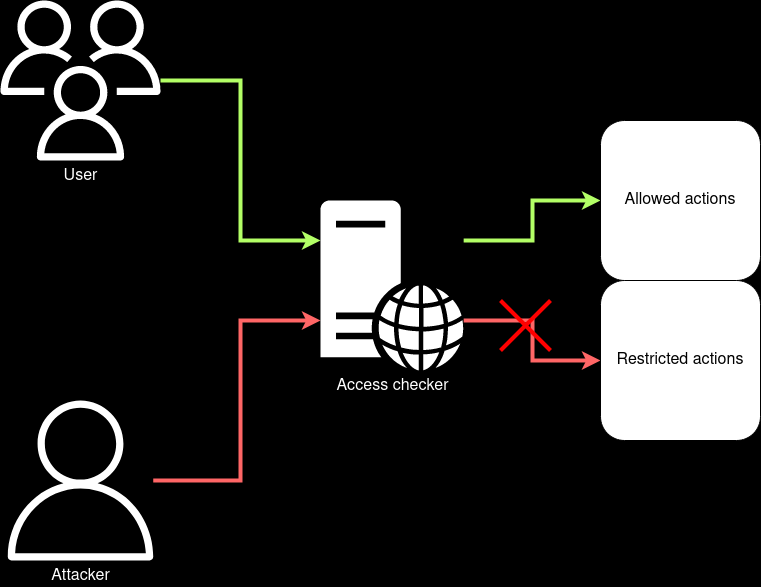

## Excessive Trust

Trust is based on a weak factor.

### How to detect

For each connection in the data flow diagram ask the question _"How does one component authenticate another?"_

### Reasons

* Easy to implement at small scale
* Integration with legacy systems

### Consequences

* Compromising one component gives access to others
* Hard to investigate full compromising chain

### Examples

#### Internal Network Trust

Trust beetween microservices based on IP addresses. Each microservice accept all requests from internal network.

This architecure is vulnerable for SSRF attacks. So attacker can easly access to different microservices through vulnerable microservice.

#### Insufficient Access Control

There is a separate component responsible for access control. Other components excessive trust to this component.

Attacker can exploit the anti-pattern through requests parsing inconsistency:

#### UserID in interservice requests and batch processing

The frontend component checks user session, extract usedID and sends internal requests with userID parameter:

### How to avoid

* Use [Zero Trust Principles](https://en.wikipedia.org/wiki/Zero_trust_security_model)