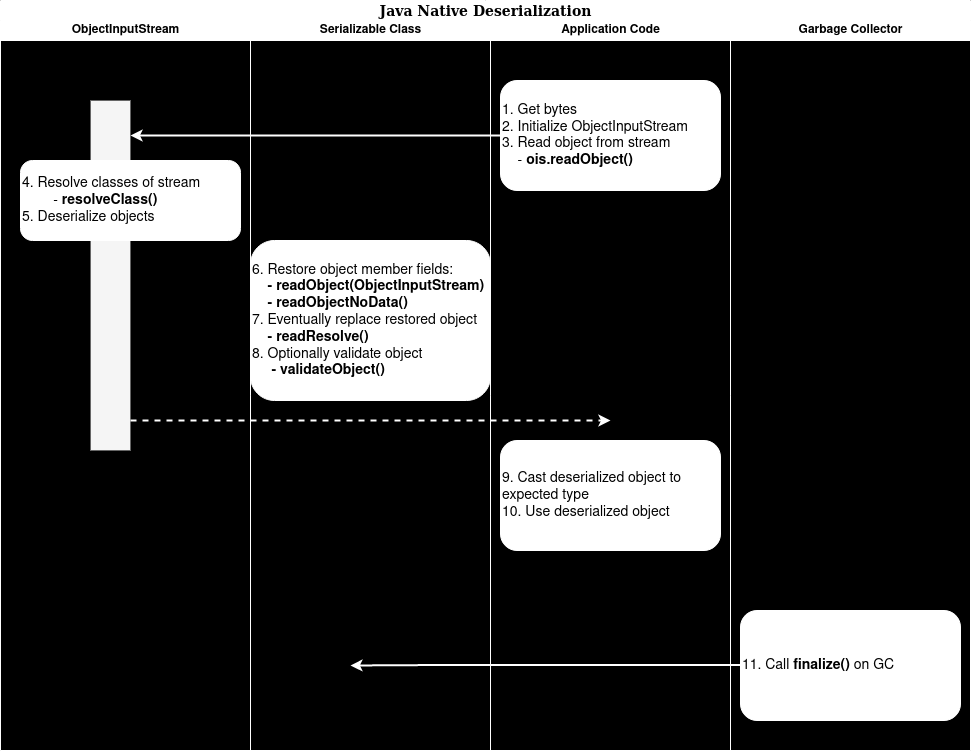

## Incidental complexity

Solution that is hard to verify from security perspective. Solution can be simplified. 

### How to detect

Can we simplify the functionality? 

### Reasons

* Too customizable

### Consequences

* Vulnerabilities in "hidden" functionality

### Examples

#### Java deserialization

### How to avoid

* Keep It Simple Stupid (KISS)
