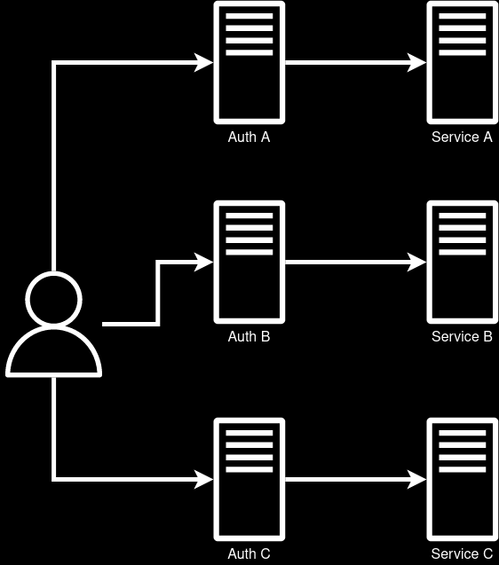

## Reinventing the wheel

Re-implementing the same solution over and over again for different services. 

### How to detect

* Do we already have a solution to this problem?
* Do we solve similar problems over and over again?
* Can custom functionality be more efficient if it's a centralized solution? 

### Reasons

* Lack of customisation for a centralized solution

### Consequences

* Difficulty of scaling centralized solutions
* The same problems occur in different implementations

### Examples

#### Custom Auth for each service

Example of the "Revinventing the wheel" antipattern is custom authentication implementation for each service.

### How to avoid

* Use a centrally approved solution