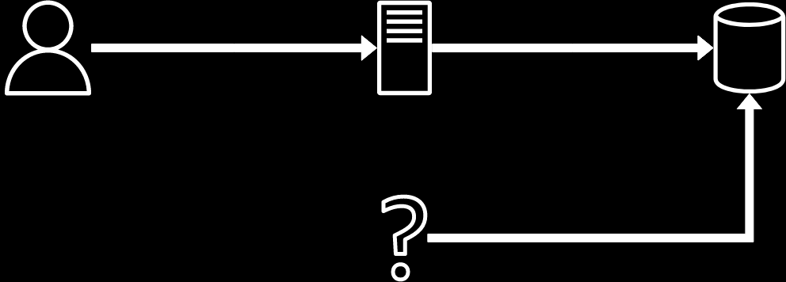

## Uncontrooled access

Lack of sufficient control over access to important data.

### How to detect

* Is there any other way to access data?
* What should we do to change the access policy?

### Reasons

* Lack of control and inventory

### Consequences

* Inconsistent access control

### Examples

#### Uncontrolled 3d-party access

### How to avoid

* Enforce access control policy in one place
* Inventory of all access points
